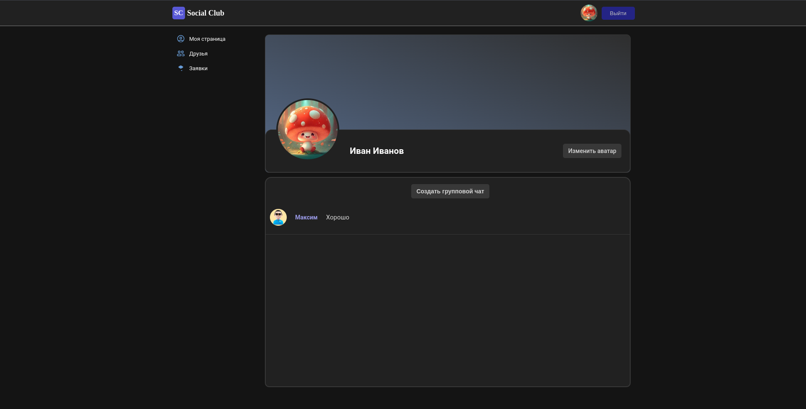

# SOCIAL_CLUB README

### Скриншоты

###Инструкция по запуску
1. Перейти в директори backend.
2. Создать .env файл со следующими переменными. Если с клиента не планируете менять config, то PORT оставляете таким же.
  -PORT=5000
  -DB_NAME=social_club
  -DB_USER=hauwei
  -DB_PASSWORD=hauwei
  -DB_HOST=localhost
  -DB_PORT=3306
  -JWT_SECRET=aslmgasdgredmkcz124qrwesfd
3. При первом запуске сервера необходимо закомментировать строку в файл role/role.controller.ts декоратор @UseGuards(AuthGuard), для создания роли.
4. Запустить сервер командой yarn start(все команды перечислены в package.json)
5. Создать роль, можно через postman
6. Перейти в директорию fronted.
7. Запустить клиент командой ng serve, все команды так же указаны в package.json.  
